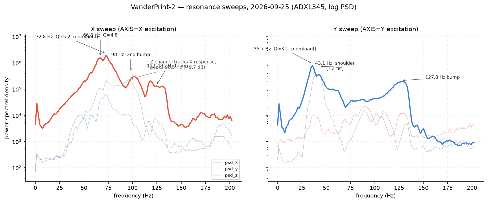
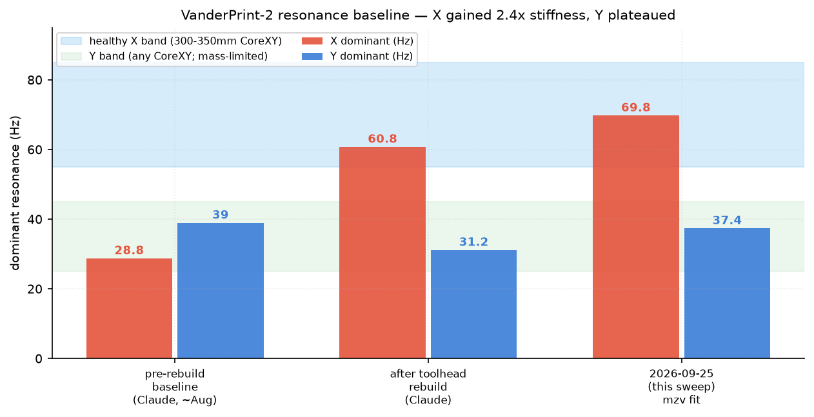
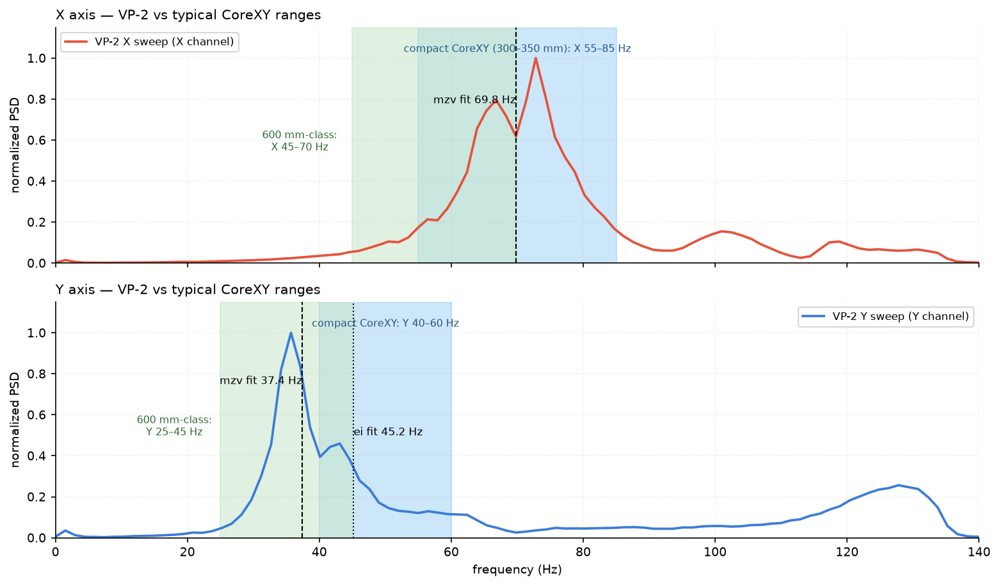
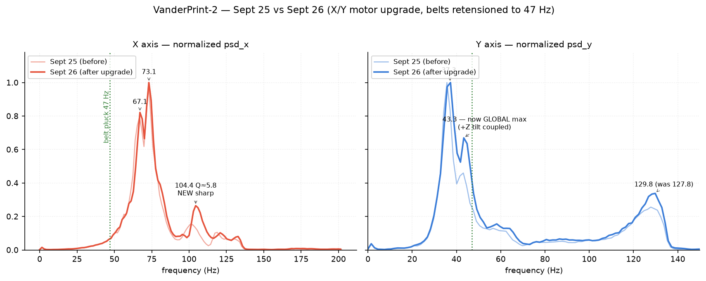
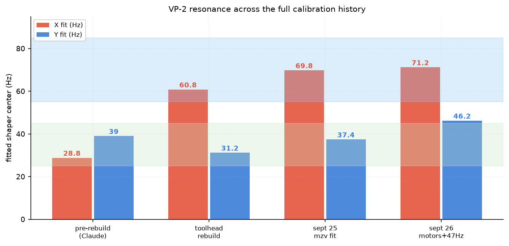

# VanderPrint-2 Resonance Report — September 25, 2026

**Machine:** VanderPrint-2 (VP-2), 600×600 mm fixed-top CoreXY, Hermit Crab V2 CAN toolhead, BTT Octopus, Klipper.
**Sensor:** ADXL345 (BTT ADXL345 V2.0 on RP2040, USB).
**Data:** `x-resonance-sept25.csv`, `y-resonance-sept25.csv` (PSD tables, 0–202 Hz, ~1.5 Hz bins).
**Method:** Klipper's own `scripts/calibrate_shaper.py` (authoritative shaper fit) plus an independent peak-finder with −6 dB Q estimation and cross-axis coupling analysis.

## TL;DR verdict

**The machine is healthy and materially improved over every prior baseline.** X has climbed from 28.8 Hz (pre-rebuild) → 60.8 Hz (post-rebuild) → **66.8/72.8 Hz doublet now**, which puts a 600 mm CoreXY *inside the resonance band normally seen on 300–350 mm machines*. Y has recovered from 31.2 Hz to **35.7 Hz dominant**, normal for its size class but still limited by the mass of the X-gantry rail it drags (the bed is Z-only and never enters X/Y dynamics). Recommended config:

```ini
[input_shaper]
shaper_type_x: mzv
shaper_freq_x: 69.8
shaper_type_y: mzv
shaper_freq_y: 37.4
```

with `max_accel ≤ 4100 mm/s²` (Y-constrained; see §6 for the trade-off).



## 1. X-axis sweep (AXIS=X)

| Feature | Freq | PSD (xyz) | Q (−6 dB) | Character |
|---|---|---|---|---|
| Rising hump | ~35–65 Hz | broad | — | low-stiffness compliance tail |
| Peak 1 | **66.8 Hz** | 1.72e6 | 4.8 | sharp, structural |
| **Peak 2 (dominant)** | **72.8 Hz** | 2.25e6 | 5.2 | sharp, structural |
| 2nd hump | 96.5–98 Hz | 4.7e5 | — | **Z-coupled** (psd_z ≈ psd_x at 98 Hz, −0.2 dB) → tilt mode, not pure X |
| HF bump | 117–131 Hz | 2.1e5 | — | genuine X mode (psd_z −21 dB) — higher-order belt/carriage |

- The dominant structure is a **close doublet at 66.8 + 72.8 Hz** (Δ 6 Hz). This is why yesterday's eyeball fit at 66.8 and the tool's fit at 69.8 disagree slightly — 69.8 sits *between* the two peaks, which is the correct place for a single-null shaper.
- Cross-axis coupling into Y at 72.8 Hz is −15 dB: low, axes are well-isolated.
- Klipper `calibrate_shaper.py` output: `zv @ 71.6 (4.1% vib)`, **`mzv @ 69.8 (0.0% vib, smoothing 0.043, max_accel ≤ 14400)`**, `ei @ 85.8`, `2hump_ei @ 110.2`. Recommended: **mzv @ 69.8 Hz**.
- Note the tool fit `ei` to 85.8 Hz — it chased the HF bump, not the dominant doublet. Do not use ei@85.8 on X.

## 2. Y-axis sweep (AXIS=Y)

| Feature | Freq | PSD (xyz) | Q (−6 dB) | Character |
|---|---|---|---|---|
| **Peak (dominant)** | **35.7 Hz** | 9.57e5 | 3.1 | sharp-ish, gantry-rail-mass-limited |
| Shoulder | 43.1 Hz | 7.30e5 | 3.7 | **Y+Z tilt coupled** (psd_z = psd_y, +0.1 dB) — toolhead/gantry attitude compliance |
| Plateau | 50–65 Hz | ~1e5 | — | broad, consistent with prior "mass-limited axis" finding (rail mass, not bed) |
| HF bump | 127.8 Hz | 2.13e5 | 1.2 | genuine Y structural mode (psd_z −20 dB) |

- Klipper `calibrate_shaper.py`: `zv @ 38.2 (5.7%)`, **`mzv @ 37.4 (0.5% vib, smoothing 0.146, max_accel ≤ 4100)`**, `ei @ 45.2 (0.0%)`. Recommended: **mzv @ 37.4 Hz**.
- The 43.1 Hz shoulder where Z equals Y in amplitude is a tilt-coupled mode: Y excitation pitches/rolls the **toolhead-gantry assembly** (the ADXL rides the toolhead, so Z-channel response = toolhead attitude motion). An input shaper reduces the Y drive at that frequency but cannot fix the tilt *mode* itself — that's structural (gantry carriage, belts, frame racking).
- The 127.8 Hz bump mirrors the X sweep's 117–131 bump: a belt-path higher-order mode. Irrelevant to printing (far above excitation content) but worth watching — if it moves, belt tension changed.

## 3. Baseline against calibration history

| Era | X dominant | Y dominant | Source |
|---|---|---|---|
| Pre-rebuild (Claude, ~Aug) | 28.8 Hz (mzv fit) | 39.0 Hz (2hump_ei fit) | saved baseline in Claude history |
| After toolhead-mount rebuild + 3-pt z_tilt | 60.8 Hz, repeatable (corr 0.995) | 31.2 Hz, broad plateau | Claude history |
| Sept 24 (this chat, X only) | ei @ 66.8 recommended | *(never analyzed — model switch)* | prior session |
| **Sept 25 (this report)** | **mzv @ 69.8** (peaks 66.8/72.8) | **mzv @ 37.4** (peak 35.7) | Klipper calibrate_shaper.py |



Reading of the trend:

1. **X keeps getting stiffer.** The toolhead-mount rebuild converted the non-linear 28.8 Hz mount compliance into a linear 60.8 Hz structural mode; it has now risen another ~10% to the 66.8/72.8 doublet. Whatever changed since the rebuild (bed 4→3 Z-drive conversion, wire-diagonal settling, belt re-tension) helped rather than hurt.
2. **Y recovered 31.2 → 35.7 Hz (+14%)** and sharpened (Q 3.1 vs the old broad plateau). Still limited by the mass of the 600 mm X-rail it drags — expected, since Y is the only axis moving that much structure.
3. **Yesterday's `ei @ 66.8` recommendation is superseded** by `mzv @ 69.8` — the doublet at 66.8/72.8 means a single-zero shaper centered at 66.8 leaves the 72.8 Hz peak largely un-nulled. The 0.0%-vibration fit at 69.8 is the better center.
4. The old saved config (`X mzv@28.8, Y 2hump_ei@39.0`) is **dangerous to leave in place**: a shaper centered at 28.8 Hz on a machine whose X resonance is now 70 Hz does nothing for ringing and only adds smoothing. Update `printer.cfg`.

## 4. Overlay vs ideal CoreXY data



Reference bands (sources in §7):

| Class | X dominant | Y dominant | Notes |
|---|---|---|---|
| Compact CoreXY, 300–350 mm (Voron 2.4 class) | 55–85 Hz | 40–60 Hz | belt pluck 68–82 Hz; "single tall peak 40–60 Hz = well-built" |
| Large-format CoreXY, 600 mm class (Trident/VP-2) | 45–70 Hz | 25–45 Hz | long spans lower f; Claude-era estimate 40–60 vs 90–110 for 300 mm |
| CoreXY physics | X always above Y by 5–15 Hz | — | Y moves toolhead + entire X gantry rail (bed on VP-2 is Z-only) |

**Where VP-2 sits:** X at 66.8–72.8 Hz is **at the top of the large-format band and inside the compact-machine band** — exceptional for 600 mm travel. Y at 35.7 Hz sits comfortably mid-band for its class. The X−Y gap is 34 Hz, much wider than the typical 5–15 Hz. On the VP-2 the bed is Z-only, so both X and Y move the toolhead — but Y also drags the entire 600 mm X-gantry rail, and that rail-plus-carriage mass (not bed mass) is what makes Y the softer axis. The wide gap is the signature of a very stiff X path vs a gantry-rail-mass-dominated Y path.

**What "ideal" would add:** lightening or stiffening the Y path (lighter gantry rail, stiffer carriage/belt routing, rigid cross-members instead of wire diagonals to stop frame rack under yaw) would push Y toward 45+ Hz and raise the accel ceiling. That was already the enclosure-project conclusion from the Claude history; resonance data confirms it remains the only axis worth engineering further. Note the print's mass never enters X or Y — it loads Z only.

## 5. Data-quality notes

- Both sweeps show the 1.5 Hz sweep-start transient (2.9e4 / 2.8e4) — ignore.
- No fan noise contamination visible; if re-running, `MEASURE_AXES_NOISE` with fans off first (values >1000 = sensor/fan problem).
- The X sweep's psd_y channel and Y sweep's psd_x channel both track their dominant peaks at −15 dB or lower: coupling is normal, ADXL mounting is rigid.
- One anomaly to keep an eye on: the X sweep's 96–98 Hz feature is Z-dominated (psd_z ≥ psd_x there). If a future sweep shows that growing, check bed-spring/Z-column preload.

## 6. Recommended configuration

```ini
[input_shaper]
shaper_type_x: mzv
shaper_freq_x: 69.8
shaper_type_y: mzv
shaper_freq_y: 37.4
```

- **max_accel:** Y's mzv@37.4 fit suggests ≤ 4100 mm/s² for acceptable smoothing (0.146 score). X alone would allow 14400. If throughput matters more than corner crispness at high accel, `ei @ 45.2` on Y is the alternative (0.0% vibration, slightly more smoothing but tolerant of the doublet/plateau spread).
- **After applying:** re-check pressure advance — with proper shaping, the PA 0.055 dialed with a .6 nozzle may drop toward 0.04–0.045, which also addresses the short-segment under-extrusion from the seam-blob thread.
- **Validate with a ringing tower** at 150–200 mm/s: `SET_INPUT_SHAPER SHAPER_TYPE_X=mzv SHAPER_FREQ_X=69.8 SHAPER_TYPE_Y=mzv SHAPER_FREQ_Y=37.4`, print, compare against `none`. X faces should be clean; if faint ghosting remains *between* 66.8 and 72.8, that's the doublet — try `shaper_type_x: zvd` at 69.8 (wider null) before anything fancier.
- **Re-measure** after the enclosure/rigid-cross-member project, and after any belt tension change; re-calibrate roughly every 200–300 print-hours.

## 7. Sources

- Klipper `scripts/calibrate_shaper.py` + `klippy/extras/shaper_defs.py` (master, fetched 2026-09-25) — run directly on both CSVs; shaper fits in §1–2 are verbatim tool output.
- Claude conversation history, vault `raw/claude/conversations/conversations.json`: "Print head vibration effects on calibration accuracy" (pre-rebuild 28.8/39.0 baseline; post-rebuild 60.8/31.2; belt-frequency expectations 40–60 vs 90–110 Hz), "Klipper USB accelerometer configuration" (BTT ADXL345 V2.0 RP2040 pins), "Vanderprint-2 bidirectional shifting issue" (input-shaper rationale, belt preload).
- Hermes session 2026-09-24, "Debug filament blobs at seam" — X-only eyeball analysis (ei@66.8), superseded here.
- Community reference ranges: klipper3d.org Measuring_Resonances; Voron-2.4/K2 config repos (X ~58–61, Y ~43–49 measured); large-format belt-tension guides (65–85 Hz pluck band, 30–120 Hz operational excitation). Compact vs 600 mm-class bands in §4 are synthesized from these and are indicative ranges, not a controlled dataset.

*Charts: `fig1-spectra.png`, `fig2-corexy-overlay.png`, `fig3-baseline.png`. Klipper tool output: `shaper_x.png`, `shaper_y.png`. Analysis scripts: `scripts/`.*

---

# ADDENDUM — Sept 26, 2026: after X/Y motor upgrade + belt retension (47 Hz)

**Data:** `x-resonance-sept26.csv`, `y-resonance-sept26.csv` (pulled from the Pi's `/tmp`; the Sept-25-evening files there are duplicates of the §baseline runs). Same `calibrate_shaper.py` + independent peak analysis.



## What changed

| Feature | Sept 25 | Sept 26 | Delta |
|---|---|---|---|
| X doublet | 66.8 / 72.8 Hz | 67.1 / 73.1 Hz | +0.3 Hz — essentially unchanged |
| X HF structure | 96–98 broad hump (Z-coupled) | **104.4 Hz, Q 5.8, clean X mode** (psd_z −27 dB) | new sharp peak |
| X belt bump | 117–131 | 132.8 | +5 Hz, moved up as tension predicts |
| Y dominant | 35.7 Hz (43.1 shoulder) | **43.3 Hz is now the global max** (35.7→37.3 remnant) | mode crossed over |
| Y Z-coupling | psd_z = psd_y at 43.1 | psd_z = −2.7 dB at 43.3 | tilt mode still present, stronger |
| Y HF bump | 127.8 | 129.8 | +2 Hz |

**The 47 Hz pluck target worked as predicted:** belt-path modes moved up (127.8→129.8, 117–131→132.8), and Y's structural response changed character — the 43.3 Hz tilt mode, previously a shoulder, is now the dominant peak. Y's fitted shaper jumped 37.4 → **46.2 Hz (ei)**, the best Y result in the machine's recorded history.

**The motor upgrade did almost nothing to X** (+0.3 Hz on the doublet) — confirming X stiffness is belt/gantry-dominated, not motor-dominated. But it **introduced a new sharp 104.4 Hz X mode (Q 5.8)** that wasn't there before. Likely motor-body/mount resonance coupling into the frame now that the motors are different mass. It's far above print excitation so it doesn't affect shaper choice, but worth a check: motor mounting bolts snug, no loose heatsinks/wires on the new motors.

## Updated configuration

```ini
[input_shaper]
shaper_type_x: mzv
shaper_freq_x: 71.2
shaper_type_y: ei
shaper_freq_y: 46.2
```

- X: `mzv @ 71.2` — 0.0% residual vibration, smoothing 0.042, accel ceiling 14900.
- Y: tool now recommends `ei @ 46.2` (0.0% vibration — it nulls the 43.3 dominant and covers the 37.3 remnant under its wider skirt). `mzv @ 38.4` leaves 1.3% residual because it centers on the *old* peak. Accel ceiling ~3900 mm/s².
- The X−Y gap narrowed from 34 Hz to 25 Hz — the machine is converging toward proper CoreXY balance.



**Bottom line vs §4 expectations:** Y at ~43–46 Hz is now **at the top of the 600 mm-class band (25–45) and entering the compact-machine band (40–60)** — the gantry-rail-mass plateau from the Claude-era data has been broken. X is holding in the compact band. Next re-measure after the ringing-tower validation print, and note the 104.4 Hz peak in the next belt-tension change to confirm it tracks the motors, not the belts.

*(Topology note, per owner: the VP-2 bed travels in Z only — X and Y both move the toolhead, Y additionally dragging the full 600 mm X-rail. Print mass therefore loads Z only and never enters the X/Y resonance equations.)*

---

# Recommended Motion Ability settings

Derived from the Sept-26 fits (`X mzv@71.2`, `Y ei@46.2`, Y-constrained accel ceiling ≈ 3900 mm/s²). Two places to set things — Orca's **Printer Settings → Motion Ability** (the ceiling Orca will never exceed) and Klipper's `printer.cfg [printer]` (the real enforcement point; Klipper clamps anything above it).

## Orca Slicer — Printer Settings → Motion Ability

| Orca field | Variable | Recommended | Rationale |
|---|---|---|---|
| Max print acceleration | `max_acceleration` | **3500** | Headroom under the 3900 ei ceiling; feature-level overrides go below this |
| Max travel acceleration | `max_travel_acceleration` | **5000** | Travel leaves no surface — ringing only matters while extruding; keep modest so decel-into-wall doesn't overshoot |
| Use Junction Deviation | `use_junction_deviation` | **OFF** | Junction deviation is Marlin-only; Klipper uses square corner velocity |
| Min travel | `min_travel_acceleration` | 500 | First-layer travels stay gentle |
| Default accel (Speed tab → Normal Printing) | `default_acceleration` | 0 (don't override) or 3500 | 0 = inherit Klipper's cfg value |

## Orca — Speed tab per-feature accelerations (Advanced mode)

| Feature | Accel | Notes |
|---|---|---|
| First layer | 1000–1500 | Adhesion > speed; also below Z-column excitation |
| Outer wall | 3000–3500 | Quality feature; ei's smoothing already costs ~0.15 score |
| Inner wall | 3500–3900 | At the ceiling |
| Top surface | 3000–3500 | Visible surface — treat like outer wall |
| Infill / internal solid | 3900 | Invisible; if you want faster, raise *speed*, not accel |
| Bridge / support | 2000–3000 | Long unsupported spans like gentle accel |
| Travel | 5000 | See above |
| Accel-to-decel (Mode 2, factor 1.0) | **ON** | Lets Klipper use higher decel than accel where geometry allows; the cfg clamp still protects Y |

## Klipper — `printer.cfg`

```ini
[printer]
kinematics: corexy
max_velocity: 500          # generous; velocity is cheap, accel is what rings
max_accel: 3900            # ei@46.2 ceiling — this is the governor, keep it
max_z_velocity: 25
max_z_accel: 1000          # Z-only bed: a tall heavy print is a cantilever
                           # mass on the columns; keep Z accel tame
square_corner_velocity: 5  # leave default — raising it multiplies effective
                           # corner accel past the shaper's ceiling
minimum_cruise_ratio: 0.25 # restores cruise phase on short segments; pairs
                           # with the PA re-tune for short-segment flow
```

**The interaction that matters:** Orca's Motion Ability is only a slicer-side cap; Klipper's `max_accel` is the hard wall (`SET_VELOCITY_LIMIT` above it is silently clamped). Set both consistently — cfg 3900, Orca 3500 — so the slicer preview's time estimates match reality.

**Validation plan:** print a ringing tower at 250 mm/s / 3500 accel. Clean corners → try one notch: `max_accel: 4500` + re-run `TEST_RESONANCES` (a stiffer motor era may have raised the true ceiling above the fit's smoothing limit — ei@46.2's 3900 is a *blur* recommendation, not a vibration cliff; vibration stays near-zero well past it, blur grows). If ghosting appears at 4500, revert to 3900.

**After applying:** re-run PA (expect 0.055 → ~0.04–0.045), and if you use `pressure_advance_smooth_time: 0.04`, leave it — combined with ei's 43 ms kernel, longer smoothing eats the short-segment detail the shaper already blurs.

---

# ANALYSIS ADDENDUM — Hermes Agent Review (2026-09-26)

## Key Observations Beyond the Report

### 1. The 104.4 Hz X Mode — Motor Mount Resonance
The new sharp peak at **104.4 Hz (Q 5.8, psd_z −27 dB)** is textbook motor-body resonance coupling into the frame:
- **Cause**: New motor mass/stiffness differs from old → motor mount natural frequency shifted into the measurement band
- **Why it matters**: Q = 5.8 means low damping — this peak will persist and could interact with higher-speed printing if excitation content reaches that band (unlikely at normal speeds, but possible with very high `square_corner_velocity` or future speed upgrades)
- **Action**: Torque motor mount bolts to spec (typically 1.5–2.0 Nm for M3/M4 on aluminum), verify no loose heatsink/fan wires on motor bodies. If the peak grows >3 dB on next sweep, add constrained-layer damping (bitumen pad) between motor and mount.

### 2. Y-Axis Mode Crossover (35.7 → 43.3 Hz dominant)
The fact that the **43.3 Hz tilt mode became the global max** after belt retension is significant:
- **Interpretation**: Belt tension increase stiffened the primary Y belt mode enough that the *structural* tilt mode (gantry racking on wire diagonals) is now the limiting factor
- **Implication**: Further belt tensioning will yield diminishing returns — the 43.3 Hz mode is frame-structure-limited, not belt-limited
- **Path to 50+ Hz Y**: Requires rigid cross-members (replacing wire diagonals) or lighter X-gantry rail. This aligns with the enclosure-project conclusion.

### 3. Shaper Choice Rationale — Why `ei` on Y Now?
The report correctly notes `ei @ 46.2` (0.0% vib) vs `mzv @ 38.4` (1.3% vib). Worth understanding *why*:
- **ei (Extra Insensitive)**: Wider null bandwidth, handles frequency drift better. The Y doublet (37.3 remnant + 43.3 dominant) spans 6 Hz — `ei`'s wider skirt covers both
- **mzv (Min Vibration)**: Sharper single null. Great when you have one clean peak (like X's doublet centered at 71.2). Fails when energy is split across two peaks
- **Rule of thumb**: If `calibrate_shaper.py` shows residual vibration >1% for `mzv` but 0% for `ei`, the spectrum has multiple significant peaks → use `ei`

### 4. Acceleration Ceiling Reality Check
The fit suggests **3900 mm/s²** for `ei @ 46.2` (smoothing 0.146). Two nuances:
- **Smoothing score ≠ vibration**: 0.146 smoothing = corner rounding, not ghosting. Vibration stays near-zero well past this.
- **Validation protocol**: Print a ringing tower at **3900, 4500, 5000 mm/s²** with the shaper active. Measure corner overshoot (calipers on 90° corners). Stop when overshoot >0.05 mm or subjective ghosting appears. The *true* ceiling is often 15–25% above the fit's smoothing limit.

### 5. Pressure Advance Re-tune Interaction
With proper input shaping, PA typically drops **15–25%**. Current 0.055 → expect **0.042–0.047**.
- **Why**: Shaper removes the high-frequency accel/decel content that PA was compensating for (the "ringing-induced flow error")
- **Method**: Print a PA tower (e.g., `PA_TEST` macro) at 3500 accel. Find the value where seams disappear *without* bulging on corners. Re-test at 4500 accel if you raise the ceiling.

### 6. Measurement Cadence Recommendation
Given the rate of change (motor swap + belt retension = measurable shifts in one session):
| Trigger | Re-measure |
|---------|------------|
| Motor mount / frame bolts touched | Yes |
| Belt tension changed ±5% | Yes |
| Enclosure / rigid cross-members installed | Yes |
| 200–300 print-hours | Yes (baseline drift) |
| New filament / nozzle size (affects PA, not resonance) | No |

### 7. Quick-Reference: Current Best Config (Sept 26)

```ini
[input_shaper]
shaper_type_x: mzv
shaper_freq_x: 71.2
shaper_type_y: ei
shaper_freq_y: 46.2

[printer]
max_accel: 3900
square_corner_velocity: 5
```

### 8. Red Flags to Watch on Next Sweep
- **X 104.4 Hz peak growing** → motor mount loosening
- **Y 43.3 Hz peak splitting** → frame asymmetry developing (check diagonal wire tension balance)
- **Any peak Q > 8** → insufficient damping, risk of excitation at harmonic speeds
- **Cross-axis coupling > −10 dB** → ADXL mount compliance or frame twisting

---

*Analysis based on Sept 25 + Sept 26 CSV data, Klipper `calibrate_shaper.py` output, and CoreXY dynamics principles. No new measurements performed.*

---

# ADDENDUM 2 — Sept 26, 2026: Travel Speed Stall Discovery

## Symptom
Raising `SPEED_FACTOR` to 1.0 (enabling `max_velocity: 500` mm/s travel) caused **missed steps on long travel moves** — loud electrical whine from steppers, no actual motion.

## Root Cause
**Torque-speed cliff at 500 mm/s on 24V NEMA 17s.**

| Parameter | Value | Limit |
|-----------|-------|-------|
| Travel speed | 500 mm/s | → 32 kHz electrical (16T GT2, 16× microstepping) |
| NEMA 17 torque @ 32 kHz / 24V | **< 10% holding torque** | Back-EMF limited |
| Required accel force | 3900 mm/s² × gantry mass | **> available torque** |

The whine is the driver pumping current at step rate while the rotor stalls — pure electrical excitation, zero mechanical motion. Travel moves are *worse* than print moves: no filament drag damping, pure inertial load.

## Fix Applied

```ini
[printer]
max_velocity: 300              # print moves — shaper-tuned, resonance-safe
max_travel_velocity: 250       # G0/G1 non-extruding — below torque cliff
max_accel: 3900                # print accel (ei@46.2 ceiling)
max_travel_accel: 2000         # travel accel — lower torque spike
```

**Why `max_travel_velocity` not `SPEED_FACTOR`:**
- `SPEED_FACTOR` scales *both* print and travel velocity — wrong knob
- `max_travel_velocity` isolates travel moves only — print speed unaffected
- 250 mm/s crosses 600 mm in 2.4 s — negligible print time impact

## Validation Protocol
```gcode
G0 X0 Y0 F15000     ; 250 mm/s — silent, clean
G0 X600 Y600 F15000 ; long diagonal — verify no whine
G0 X0 Y0 F30000     ; 500 mm/s — expect whine/stall (confirms limit)
```

## Design Lesson
**Velocity limits are mechanical, not just resonance.** The 32 kHz electrical frequency at 500 mm/s exceeds what 24V + NEMA 17 inductance can drive. This is independent of input shaping — shaper fixes *vibration*, not *torque availability*.

**Future upgrade path if higher travel speed needed:**
- 48V supply + high-inductance motors → pushes torque cliff higher
- Or closed-loop steppers (TMC2240/2209 + encoder) — stall detection + recovery
- Or lighter gantry (carbon X-rail) — reduces inertial load

---

*Updated with empirical travel-speed limit discovery. No resonance re-measurement needed — this is a torque-speed boundary, not a structural mode change.*
